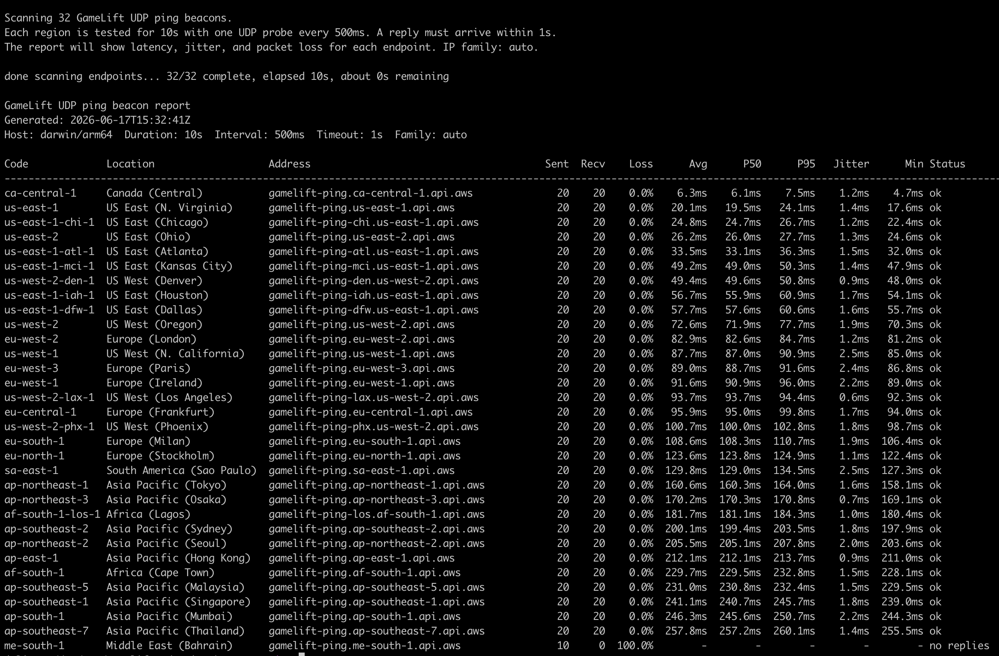

# GameLift UDP Ping Beacons

Command line tool for players to measure Amazon GameLift UDP ping beacon quality from their own network.

It probes every configured GameLift endpoint for a fixed duration and reports:

- latency: min, average, p50, and p95 round-trip time
- jitter: average absolute change between consecutive successful RTT samples
- packet loss: sent probes that did not receive a UDP reply before the timeout

## Usage

```sh
go run .
```

Useful options:

```sh
go run . -duration 30s -interval 500ms -timeout 1s
go run . -duration 30s -format json
go run . -duration 30s -family ipv4
go run . -duration 30s -family ipv6
```

Flags:

- `-duration`: how long to ping each endpoint; `0` runs until quit, default `0`
- `-interval`: delay between probes sent to each endpoint, default `500ms`
- `-timeout`: per-probe response timeout, default `1s`
- `-family`: `auto`, `ipv4`, or `ipv6`, default `auto`
- `-format`: `table` or `json`, default `table`
- `-pause`: `auto`, `always`, or `never`, default `auto`
- `-samples`: include raw RTT samples in JSON output

On Windows, `-pause auto` keeps the console open with `Press Enter to quit...` when the tool is launched with no arguments, which is the usual double-click path. It does not pause when arguments are supplied or when stdin is redirected.

In table mode, the tool opens an interactive terminal UI when stdout is a real terminal. By default it keeps pinging until you press `q`; press `space` to pause or resume pings. It shows a scrollable endpoint table, and each endpoint row updates as new UDP probe data arrives. JSON mode writes only JSON so it remains safe for automation.

The table output is optimized for pasting into support tickets. JSON output is better for automated ingestion by a game team.

## Example Report



## Build

```sh
go build -o gamelift-ping-report .
./gamelift-ping-report -duration 30s
```
